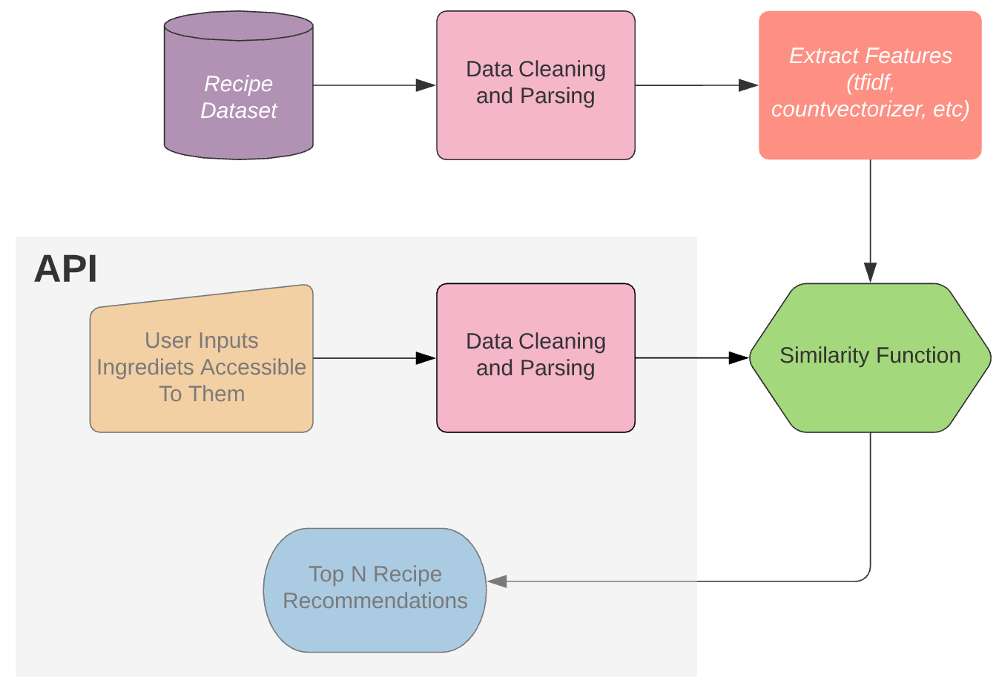
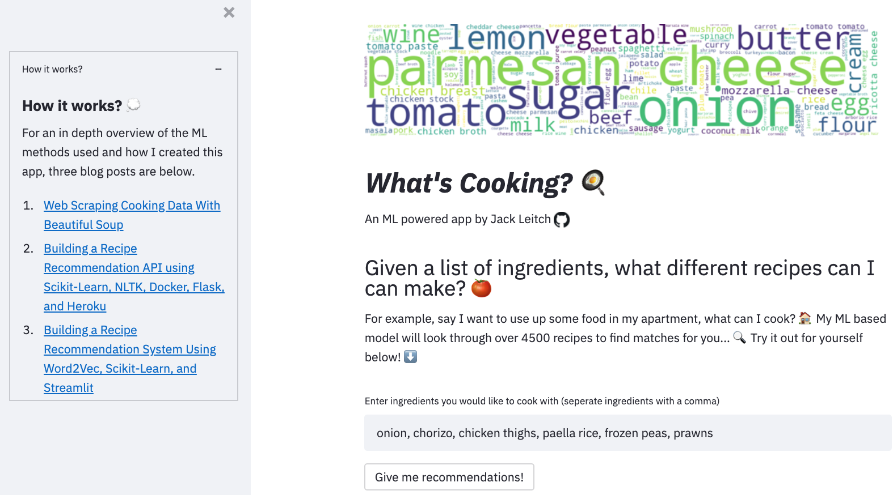

# Recipe Recommendation System
## Project Overview
* Created a tool that recommends recipes based on ingredients inputted to help students eat better food.
* Scraped over 4000 recipes from [All Recipes](allrecipes.com) and [Jamie Oliver](jamieoliver.com) using python and beautiful soup.
* Parsed recipe ingredients and created word embeddings using Word2Vec and TF-IDF.
* Created a recipe recommendation system using cosine similarity to measure Euclidean distance between the word embeddings of recipe ingredients.
* Built a client-facing API using flask, and a user-friendly [app](https://share.streamlit.io/jackmleitch/whatscooking-deployment/streamlit.py) with Streamlit.

## Motivation
Cooking is a hobby for some and a major problem for others. However, you can always use a helping hand for cooking. Being a student, it is always a difficult decision to decide what to eat for lunch or dinner. Sometimes faced with limited items in the kitchen, it is always a challenge to decide what to cook for a meal. This inspired me to create a system that can recommend recipes based on ingredient suggestions.

## Code 
**Python Version:** 3.7  
**Packages:** pandas, numpy, sklearn, gensim, matplotlib, seaborn, beautifulsoup, flask, streamlit, json, pickle  
**For Web Framework Requirements:**  ```pip install -r requirements.txt```  
**You can run this model yourself using my API:**
```
docker pull jackmleitch/whatscooking:API
docker run -p 5000:5000 -d whatscooking:api
```
## Project Write-Up
I have three blogs on this project and they can be found here:
* [Data gatherting](https://medium.com/r?url=https%3A%2F%2Fjackmleitch.medium.com%2Fusing-beautifulsoup-to-help-make-beautiful-soups-d2670a1d1d52)
* [Initital Model](https://towardsdatascience.com/building-a-recipe-recommendation-api-using-scikit-learn-nltk-docker-flask-and-heroku-bfc6c4bdd2d4)
* [Updated Model](https://towardsdatascience.com/building-a-recipe-recommendation-system-297c229dda7b)

<p align="center">

</p>

## Web Scraping
Built a **web scraper** using [Beautiful Soup](https://www.crummy.com/software/BeautifulSoup/bs4/doc/) to scrape over 4000 food recipes from [All Recipes](allrecipes.com) and [Jamie Oliver](jamieoliver.com). For each recipe, I retrieved the following:

* Recipe name 
* Ingredients
* URL
* Rating

## Data Cleaning
After scraping the data, we needed to parse the ingredients to remove redundant information that would not help distinguish recipes. The **ingredient parser** does the following:
* Lemmatize words to ensure we remove all versions of words, e.g. both pounds and pound
* Removed stopwords 
* Removed cooking measures, e.g. pounds and lbs
* Removed common household items, such as oil and butter 
* Some standard NLP preprocessing: getting rid of punctuation, removing accents, making everything lowercase, getting rid of Unicode, etc.
 
## Model Building
I fed my collection of individual ingredients into a **continuous bag of words Word2Vec** neural network to produce word embeddings. Word2Vec was used because I wanted the text representations to capture distributional similarities between words. In the context of recipe ingredients, Word2vec allowed me to capture similarities between recipe ingredients that are commonly used together. For example, mozzarella cheese which is commonly used when making pizza is most similar to other cheeses and pizza-related ingredients.

In order to build the recipe recommendation system, I needed to represent each ingredient list as a single embedding as this would then allow me to calculate corresponding similarities. **TF-IDF** was used to aggregate embeddings (as opposed to simple averaging) as it gives us better distinguishing power between recipes by favoring unique ingredients.

The recommendation system was built using a **content-based filtering** approach which enables us to recommend recipes to people based on the ingredients the user provides. To measure the similarity between user-given ingredients and recipes **cosine similarity** was used. Spacy and KNN were also trialed but cosine similarity won in terms of performance (it was also the most simple approach). The recommendation model computes the cosine similarity between the inputted ingredient list and all recipes in the corpus. It then outputs the top-N most similar recipes, along with their ingredients and URLs, for the user to choose from.

## Productionization
In this step, I built a **Flask API** endpoint that was hosted on a local webserver. The API endpoint takes in a request with a list of ingredients and returns the top 5 recommended recipes (along with URLs to the recipe webpage).

I also created and deployed a more user-freindly app using **Streamlit**, which can be accessed [here](https://share.streamlit.io/jackmleitch/whatscooking-deployment/streamlit.py). 

<p align="center">

</p>
